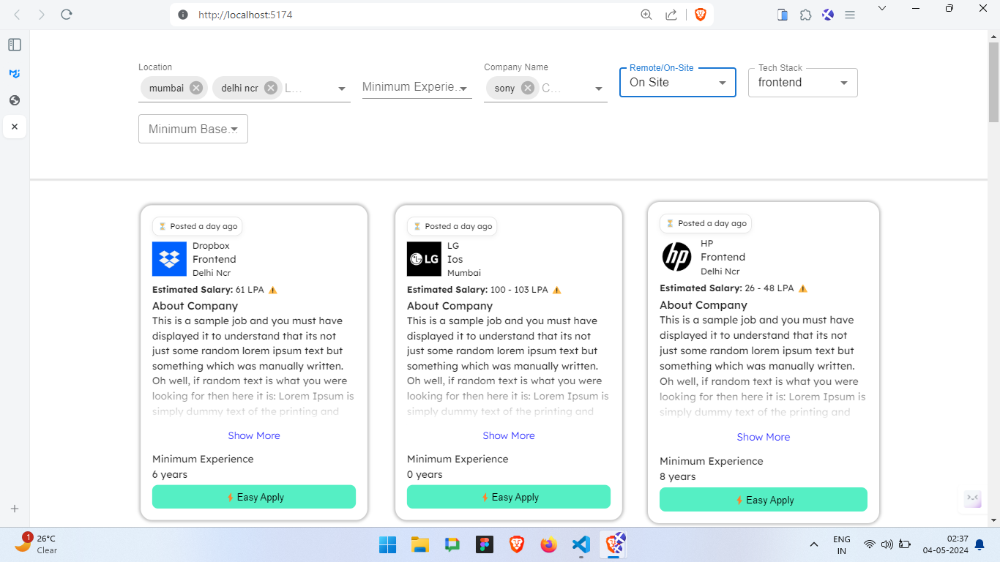

# Infinite Scroll React Redux Project



This project is a React application utilizing Redux for state management and async thunk middleware for handling asynchronous actions. It implements infinite scroll functionality to display a large list of items efficiently, along with multiple filter options.

## Description

The purpose of this project is to demonstrate how to implement infinite scroll in a React application using Redux for state management, while also integrating various filter options. These filters allow users to refine the displayed data based on criteria such as minimum experience, company name, location, remote availability, technology stack, role, and minimum base pay.

## Features

- **Infinite Scroll:** Automatically loads more items as the user scrolls down the page.
- **Redux State Management:** Manages application state using Redux for predictable and centralized state management.
- **Async Thunk Middleware:** Uses async thunk middleware to handle asynchronous actions, such as fetching data from an API.
- **Multiple Filter Options:** Allows users to filter the displayed data based on various criteria, including minimum experience, company name, location, remote availability, technology stack, role, and minimum base pay.
- **React Components:** Organizes UI elements into reusable React components for a modular and maintainable codebase.

## Installation

1. Clone the repository:

   ```bash
   git clone https://github.com/munkpanchal/assignment.git
  
2. Navigate to the project directory:
   ``` bash 
   cd assignment

3. Install dependencies:
   ``` bash 
   npm install or yarn
  
4. Start the development server:
   ``` bash 
    npm start or yarn start
  
5. For Production
    ```
    npm run build or yarn build
